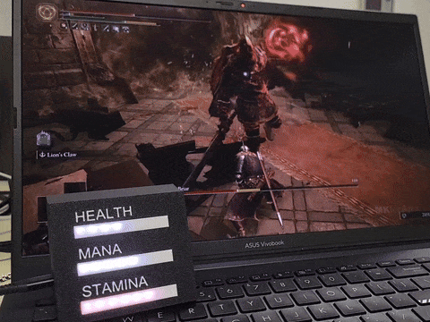

# Game_Bar_Detector
\
**Project maker: Thomas Fokkema**\
This project connects real-time game data to physical LEDs using computer vision and a Raspberry Pi Pico W. We automatically detect on-screen status bars (like health, mana and stamina in Elden Ring) and visualize them using WS2812 LEDs.
### ⚙️ How it works
Screen Capture: A lightweight Python program continuously captures the screen where the in-game bars are located. And is going to automaticly check where a bar is.
Automatic Bar Detection: The script analyzes pixel colors to determine how full each bar is (for example, detecting the length of the green health bar and the blue armor bar).
Data Processing: The fill percentage is converted into numerical values (0–100%) for each bar.
LED Visualization: These values are sent over Wi-Fi to a Raspberry Pi Pico W, which drives the WS2812 LED strip.
The health bar might fill the LEDs in red or green,
The armor bar could use blue LEDs,
Both dynamically respond as the in-game values change.
### ⚠️ Difficulties & Challenges
Developing this system introduces several technical challenges:
    1. Real-Time Processing
        ◦ The script must process screen captures at least 20–30 times per second to keep the LEDs responsive.
        ◦ Balancing speed and accuracy is tricky — heavy image processing can cause noticeable delays.
        ◦ Efficient use of OpenCV and region-of-interest cropping helps minimize lag.
    2. Automatic Bar Detection
        ◦ Bars vary in color, shape, and position between games, making automatic detection difficult.
        ◦ Lighting effects, damage flashes, or UI animations can confuse the color detection algorithm.
        ◦ Calibration is often required: the user might need to select the bar region manually once, and the program tracks it afterward.
    3. Noise and Accuracy
        ◦ Small changes in the game’s color tone can create detection noise.
        ◦ Smoothing algorithms or averaging over several frames help reduce flickering LEDs.
    4. Communication Latency
        ◦ Sending data wirelessly to the Pico W must be fast and consistent to maintain synchronization with the gameplay.
        ◦ Optimizing the network update rate (e.g., 10–30 Hz) is crucial for real-time feel.

### 🌈 Result
Once fine-tuned, the result is an immersive system that extends the game beyond the screen. A responsive LED lights that visually represents your in-game health, armor, or stamina in real time. It’s both a fun visual project and a great introduction to computer vision, microcontrollers, and real-time data streaming.

### 🔧 Materials
- Powerfull processing machine
- Raspberry pi pico W
- ws2812 ledstrip
- level shifter
- Some wires and a breadboard

### 🌊 Code flow
Health Bar Detection Script
Captures screen and detects health bars using edge detection and color analysis.
Tracks detected bars for 60 seconds, then locks onto the most frequently detected ROIs.

**Code Flow**
1. **Capture:** `Code/Screen_Capture.py` or `Code/Screen_Capture_rgb.py` continuously captures the chosen monitor using `mss` and converts frames to BGR images for OpenCV processing.
2. **Preprocess:** Each frame is converted to grayscale, blurred and run through Canny edge detection to find candidate contours (potential bars).
3. **Candidate filtering:** Contours are filtered by aspect ratio and size to find long, thin ROIs likely to be status bars.
4. **Color analysis:** For each candidate ROI the code computes a masked reference color (BGR) and uses either grayscale thresholds (for white bars) or per-pixel Euclidean color distance to the ROI mean to compute a fill ratio.
5. **Tracking & confirmation:** During a 60-second tracking phase the script records normalized ROIs. After the period it selects the most frequently seen ROIs as `confirmed_rois` and stores a reference color per confirmed ROI.
6. **Assignment:** Confirmed ROIs are mapped positionally (left → bar 1, middle → bar 2, right → bar 3). You can also override the output color for each bar with command-line flags.
7. **Fill measurement:** On each frame the script measures how many pixels in the confirmed ROI still match the stored reference color (fill ratio), and maps that to an LED count (0–8).
8. **LED output:** A small `Code/pico_client.py` module opens a serial connection to the Pico and sends `SET <strip> <count> <r> <g> <b>` commands when a bar's LED count or color changes.
9. **Instrumentation & tuning:** Timing instrumentation records step durations and can write a CSV (`timing_log.csv` / `timing_log_rgb.csv`). A live `Controls` window exposes thresholds (std, color distance, fill %, white threshold) as OpenCV trackbars for real-time tuning.
10. **Visualization:** The detection window draws candidate ROIs, confirmed tracked ROIs (with a stored color swatch and assigned bar number), and a small Controls UI for live tweaks.

### How to run Windows:
1. install python 3.12.10
2. ``python -m venv .\vm``
3. (if venv isnt activated) -> ``vm\Scripts\activate``
4. If you get a security error like “execution of scripts is disabled” -> ``Set-ExecutionPolicy -Scope Process -ExecutionPolicy Bypass``
5. ``pip install -r requirements.txt``

### How to run Linux debian based:
1. install python 3.12.10
2. ``python -m venv \vm``
3. ``source vm/bin/activate``
4. ``pip install -r requirements.txt``

